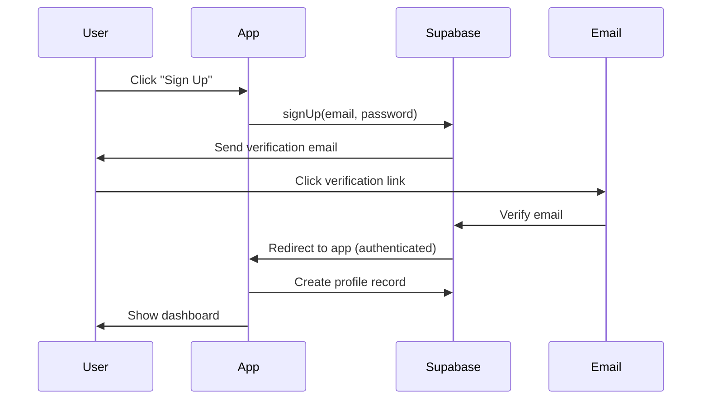
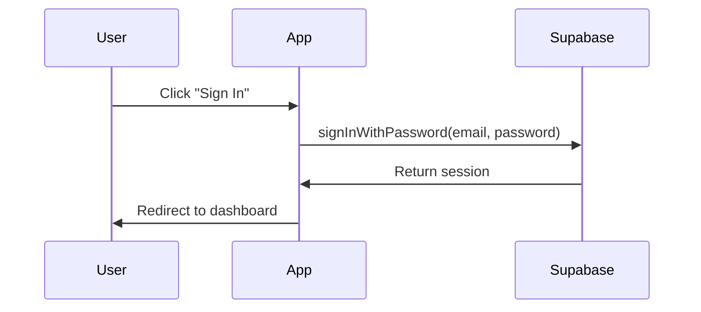
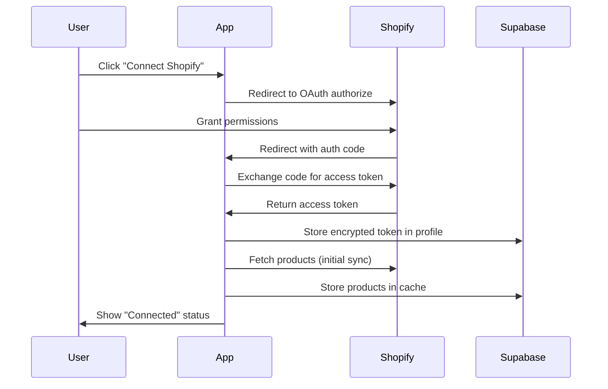

# Boron Builder: Authentication & Shopify Integration

**Version:** 1.0
**Status:** Planning
**Last Updated:** 2025-10-28

## Overview

This spec outlines the design for adding user authentication and Shopify integration to Boron Builder. Users will be able to save generated funnels to their account and sync product data from their Shopify store.

## Goals

1. **User Authentication**: Allow users to create accounts and sign in
2. **Funnel Management**: Save, edit, and manage multiple funnels per user
3. **Shopify Integration**: Connect Shopify stores to auto-populate product data
4. **Draft System**: Funnels can be saved as drafts before publishing
5. **Product Sync**: Periodic sync of Shopify products, images, and details

## User Flow

### Current Flow (Anonymous)
1. User visits Boron Builder
2. User chats with AI to generate funnel
3. User previews funnel
4. ~~User leaves (funnel lost)~~ → **NEW: User can save funnel**

### New Flow (Authenticated)
1. User visits Boron Builder
2. **User signs up / signs in (optional, or prompted when saving)**
3. User chats with AI to generate funnel
4. User previews funnel
5. **User clicks "Create Funnel" → Funnel saved as draft**
6. User can:
   - Edit funnel details
   - Connect Shopify account
   - Sync product data from Shopify
   - View all saved funnels
   - Publish funnel (future: deploy to custom domain)

## Technical Stack

### New Dependencies
- **Supabase**: Backend-as-a-Service (Auth, Database, Storage)
  - `@supabase/supabase-js` - Client library
  - `@supabase/auth-helpers-nextjs` - Next.js auth helpers
- **Shopify**:
  - `@shopify/shopify-api` - Shopify API client
  - `shopify-api-node` (alternative, lighter)

### Infrastructure
- **Supabase Project**: Free tier supports up to 50,000 monthly active users
- **Database**: PostgreSQL (via Supabase)
- **Storage**: Supabase Storage for funnel assets (images, etc.)
- **Cron Jobs**: Vercel Cron or Supabase Edge Functions for periodic sync

## Database Schema

### Users Table (Supabase Auth)
```sql
-- Managed by Supabase Auth
auth.users (
  id uuid PRIMARY KEY,
  email text UNIQUE,
  created_at timestamp,
  -- Supabase handles password, email verification, etc.
)
```

### Profiles Table
```sql
CREATE TABLE profiles (
  id uuid PRIMARY KEY REFERENCES auth.users(id) ON DELETE CASCADE,
  email text NOT NULL,
  full_name text,
  avatar_url text,
  shopify_connected boolean DEFAULT false,
  shopify_store_domain text,
  shopify_access_token text ENCRYPTED, -- Encrypted at rest
  created_at timestamp DEFAULT now(),
  updated_at timestamp DEFAULT now()
);

-- RLS Policies
ALTER TABLE profiles ENABLE ROW LEVEL SECURITY;

CREATE POLICY "Users can view own profile"
  ON profiles FOR SELECT
  USING (auth.uid() = id);

CREATE POLICY "Users can update own profile"
  ON profiles FOR UPDATE
  USING (auth.uid() = id);
```

### Funnels Table
```sql
CREATE TABLE funnels (
  id uuid PRIMARY KEY DEFAULT gen_random_uuid(),
  user_id uuid REFERENCES auth.users(id) ON DELETE CASCADE,
  name text NOT NULL,
  status text DEFAULT 'draft', -- 'draft' | 'published' | 'archived'

  -- Funnel data (from AI generation)
  funnel_data jsonb NOT NULL, -- Complete funnel JSON

  -- Product reference (optional)
  shopify_product_id text, -- Links to Shopify product

  -- Metadata
  created_at timestamp DEFAULT now(),
  updated_at timestamp DEFAULT now(),
  published_at timestamp,

  -- Analytics (future)
  views integer DEFAULT 0,
  conversions integer DEFAULT 0
);

-- Indexes
CREATE INDEX funnels_user_id_idx ON funnels(user_id);
CREATE INDEX funnels_status_idx ON funnels(status);
CREATE INDEX funnels_shopify_product_id_idx ON funnels(shopify_product_id);

-- RLS Policies
ALTER TABLE funnels ENABLE ROW LEVEL SECURITY;

CREATE POLICY "Users can view own funnels"
  ON funnels FOR SELECT
  USING (auth.uid() = user_id);

CREATE POLICY "Users can insert own funnels"
  ON funnels FOR INSERT
  WITH CHECK (auth.uid() = user_id);

CREATE POLICY "Users can update own funnels"
  ON funnels FOR UPDATE
  USING (auth.uid() = user_id);

CREATE POLICY "Users can delete own funnels"
  ON funnels FOR DELETE
  USING (auth.uid() = user_id);

-- Published funnels are publicly viewable (future)
CREATE POLICY "Anyone can view published funnels"
  ON funnels FOR SELECT
  USING (status = 'published');
```

### Shopify Products Table (Cache)
```sql
CREATE TABLE shopify_products (
  id uuid PRIMARY KEY DEFAULT gen_random_uuid(),
  user_id uuid REFERENCES auth.users(id) ON DELETE CASCADE,
  shopify_product_id text NOT NULL,

  -- Product data
  title text NOT NULL,
  description text,
  price numeric(10, 2),
  compare_at_price numeric(10, 2),
  currency text DEFAULT 'USD',

  -- Images
  images jsonb, -- Array of image URLs
  featured_image text,

  -- Variants
  variants jsonb, -- Array of variant objects

  -- Metadata
  tags text[],
  vendor text,
  product_type text,

  -- Sync tracking
  last_synced_at timestamp DEFAULT now(),
  created_at timestamp DEFAULT now(),

  UNIQUE(user_id, shopify_product_id)
);

-- Indexes
CREATE INDEX shopify_products_user_id_idx ON shopify_products(user_id);
CREATE INDEX shopify_products_shopify_id_idx ON shopify_products(shopify_product_id);

-- RLS Policies
ALTER TABLE shopify_products ENABLE ROW LEVEL SECURITY;

CREATE POLICY "Users can view own products"
  ON shopify_products FOR SELECT
  USING (auth.uid() = user_id);

CREATE POLICY "Users can manage own products"
  ON shopify_products FOR ALL
  USING (auth.uid() = user_id);
```

### Sync Jobs Table (Optional - for tracking)
```sql
CREATE TABLE sync_jobs (
  id uuid PRIMARY KEY DEFAULT gen_random_uuid(),
  user_id uuid REFERENCES auth.users(id) ON DELETE CASCADE,
  status text DEFAULT 'pending', -- 'pending' | 'running' | 'completed' | 'failed'
  type text NOT NULL, -- 'shopify_products' | 'shopify_orders'

  -- Results
  products_synced integer DEFAULT 0,
  errors jsonb,

  -- Timing
  started_at timestamp,
  completed_at timestamp,
  created_at timestamp DEFAULT now()
);

-- Indexes
CREATE INDEX sync_jobs_user_id_idx ON sync_jobs(user_id);
CREATE INDEX sync_jobs_status_idx ON sync_jobs(status);

-- RLS Policies
ALTER TABLE sync_jobs ENABLE ROW LEVEL SECURITY;

CREATE POLICY "Users can view own sync jobs"
  ON sync_jobs FOR SELECT
  USING (auth.uid() = user_id);
```

## Authentication Flow

### Sign Up Flow


### Sign In Flow


### OAuth Providers (Optional)
- Google
- GitHub
- Magic Link (passwordless)

## Shopify Integration

### OAuth Flow


### Required Shopify Scopes
- `read_products` - Read product data
- `read_product_listings` - Read product listings
- `read_inventory` - Read inventory levels (optional)
- `read_orders` - Read order data (future analytics)

### Product Sync Strategy

#### Initial Sync (on connect)
1. Fetch all products from Shopify API
2. Store in `shopify_products` table
3. Show sync progress to user

#### Periodic Sync (every 6 hours)
1. Use Vercel Cron or Supabase Edge Function
2. For each user with Shopify connected:
   - Fetch updated products since last sync
   - Update `shopify_products` table
   - Log sync job in `sync_jobs` table

#### Webhook Sync (real-time, optional)
1. Register Shopify webhooks for:
   - `products/create`
   - `products/update`
   - `products/delete`
2. Update cache immediately when webhook received

### Shopify API Rate Limits
- REST API: 2 requests/second (burst: 40 requests)
- GraphQL API: 1000 points/second
- Strategy: Use GraphQL for bulk queries, implement exponential backoff

## API Endpoints

### Auth Endpoints
```typescript
// Using Supabase Auth Helpers - these are handled automatically
// POST /auth/v1/signup
// POST /auth/v1/login
// POST /auth/v1/logout
// POST /auth/v1/recover
```

### Funnel Management
```typescript
// GET /api/funnels
// - Get all funnels for current user
// - Query params: status, limit, offset

// POST /api/funnels
// - Create new funnel
// - Body: { name, funnel_data, shopify_product_id? }

// GET /api/funnels/[id]
// - Get specific funnel

// PATCH /api/funnels/[id]
// - Update funnel
// - Body: { name?, funnel_data?, status? }

// DELETE /api/funnels/[id]
// - Delete funnel

// POST /api/funnels/[id]/publish
// - Publish funnel (change status to 'published')
```

### Shopify Integration
```typescript
// GET /api/shopify/connect
// - Redirect to Shopify OAuth

// GET /api/shopify/callback
// - Handle OAuth callback
// - Exchange code for token
// - Trigger initial sync

// POST /api/shopify/disconnect
// - Remove Shopify connection

// GET /api/shopify/products
// - Get cached Shopify products for user
// - Query params: search, limit, offset

// POST /api/shopify/sync
// - Manually trigger product sync

// POST /api/shopify/webhook
// - Handle Shopify webhooks (products/create, update, delete)
```

## UI Changes

### New Pages/Routes

#### `/auth` - Authentication Pages
- `/auth/login` - Sign in page
- `/auth/signup` - Sign up page
- `/auth/forgot-password` - Password recovery
- `/auth/reset-password` - Password reset (with token)
- `/auth/verify-email` - Email verification confirmation

#### `/dashboard` - User Dashboard
- List of saved funnels
- Create new funnel button
- Filter by status (draft, published, archived)
- Funnel cards showing:
  - Thumbnail preview
  - Name
  - Status badge
  - Created/updated dates
  - Quick actions (Edit, Duplicate, Delete, Publish)

#### `/dashboard/funnels/[id]` - Funnel Editor
- Full funnel editor (similar to current builder)
- Save changes
- Publish funnel
- Link to Shopify product (if connected)

#### `/dashboard/settings` - User Settings
- **Profile tab**:
  - Email
  - Name
  - Avatar
  - Change password
- **Shopify tab**:
  - Connect/disconnect Shopify
  - Store domain
  - Sync status
  - Last sync time
  - Manual sync button
  - Synced products count

### Modified Pages

#### `/` - Homepage
- Add "Sign In" / "Sign Up" buttons to header
- Show user avatar/menu if authenticated
- Keep current builder UI
- Add "Save Funnel" prompt if user not signed in

### New Components

#### `<AuthProvider>`
```typescript
// Wrapper component that provides auth context
// Uses Supabase auth helpers
```

#### `<ProtectedRoute>`
```typescript
// HOC that redirects to /auth/login if not authenticated
```

#### `<FunnelCard>`
```typescript
// Display funnel in dashboard grid
interface FunnelCardProps {
  funnel: Funnel;
  onEdit: (id: string) => void;
  onDelete: (id: string) => void;
  onDuplicate: (id: string) => void;
  onPublish: (id: string) => void;
}
```

#### `<ShopifyConnectButton>`
```typescript
// Button to connect/disconnect Shopify
interface ShopifyConnectButtonProps {
  isConnected: boolean;
  onConnect: () => void;
  onDisconnect: () => void;
}
```

#### `<ProductPicker>`
```typescript
// Modal to select a Shopify product for funnel
interface ProductPickerProps {
  products: ShopifyProduct[];
  onSelect: (product: ShopifyProduct) => void;
  isLoading: boolean;
}
```

### Header Updates
```typescript
// Current: Logo + Theme toggle
// New: Logo + [Dashboard, Sign In/User Menu] + Theme toggle

// User Menu (when authenticated):
// - Dashboard
// - Settings
// - Sign Out
```

## Implementation Phases

### Phase 1: Supabase Setup & Basic Auth (3-5 days)
**Goal:** Users can sign up, sign in, and access protected routes

- [ ] Create Supabase project
- [ ] Set up database schema (profiles table)
- [ ] Install Supabase dependencies
- [ ] Create auth pages (login, signup, forgot password)
- [ ] Implement auth context provider
- [ ] Add protected routes
- [ ] Update header with auth UI
- [ ] Test auth flow

**Deliverable:** Users can create accounts and sign in

### Phase 2: Funnel Management (5-7 days)
**Goal:** Users can save and manage funnels

- [ ] Create funnels table schema
- [ ] Build dashboard page
- [ ] Create funnel management API routes
- [ ] Build FunnelCard component
- [ ] Implement "Create Funnel" flow from builder
- [ ] Add edit/delete/duplicate actions
- [ ] Add draft/published status
- [ ] Test funnel CRUD operations

**Deliverable:** Users can save, view, edit, and delete funnels

### Phase 3: Shopify OAuth & Connection (4-6 days)
**Goal:** Users can connect their Shopify store

- [ ] Create Shopify app in Shopify Partners
- [ ] Set up OAuth endpoints (/api/shopify/connect, /api/shopify/callback)
- [ ] Update profiles table with Shopify fields
- [ ] Build Shopify settings page
- [ ] Implement connect/disconnect flow
- [ ] Test OAuth flow
- [ ] Handle edge cases (expired tokens, invalid stores)

**Deliverable:** Users can connect their Shopify store

### Phase 4: Product Sync (5-7 days)
**Goal:** Shopify products are synced and cached

- [ ] Create shopify_products table schema
- [ ] Implement initial sync on connection
- [ ] Build product sync API (/api/shopify/sync)
- [ ] Create sync_jobs tracking
- [ ] Implement periodic sync (Vercel Cron or Supabase Function)
- [ ] Build ProductPicker component
- [ ] Add "Link to Shopify Product" in funnel editor
- [ ] Test sync with various product types
- [ ] Handle rate limiting

**Deliverable:** Shopify products are synced and can be linked to funnels

### Phase 5: Webhooks & Real-time Sync (3-5 days) [OPTIONAL]
**Goal:** Real-time product updates via webhooks

- [ ] Implement webhook endpoint (/api/shopify/webhook)
- [ ] Register webhooks in Shopify app settings
- [ ] Verify webhook signatures
- [ ] Handle product create/update/delete events
- [ ] Test webhook delivery
- [ ] Add webhook status to settings page

**Deliverable:** Product changes in Shopify are reflected immediately

### Phase 6: Polish & Testing (3-4 days)
**Goal:** Production-ready feature

- [ ] Write E2E tests for auth flow
- [ ] Write E2E tests for funnel management
- [ ] Write E2E tests for Shopify integration
- [ ] Add loading states
- [ ] Add error handling
- [ ] Add success/error toasts
- [ ] Review security (RLS policies, token encryption)
- [ ] Performance optimization
- [ ] Documentation

**Deliverable:** Feature is tested and production-ready

## Security Considerations

### Authentication
- ✅ Email verification required
- ✅ Password strength requirements (Supabase default: 6+ chars)
- ✅ Rate limiting on auth endpoints
- ✅ Secure session management (httpOnly cookies)
- ✅ CSRF protection (Supabase handles)

### Authorization
- ✅ Row Level Security (RLS) on all tables
- ✅ Users can only access their own data
- ✅ Published funnels are publicly viewable (future)

### Shopify Integration
- ✅ Store access tokens encrypted at rest
- ✅ Use environment variables for app credentials
- ✅ Validate webhook signatures
- ✅ Implement token refresh logic
- ✅ Scope principle: Only request necessary permissions

### General
- ✅ Input validation on all API endpoints
- ✅ Sanitize user input before storing
- ✅ HTTPS only in production
- ✅ Regular dependency updates

## Environment Variables

```bash
# Supabase
NEXT_PUBLIC_SUPABASE_URL=https://xxxxx.supabase.co
NEXT_PUBLIC_SUPABASE_ANON_KEY=eyJhbGciOiJIUzI1NiIsInR5cCI6IkpXVCJ9...
SUPABASE_SERVICE_ROLE_KEY=eyJhbGciOiJIUzI1NiIsInR5cCI6IkpXVCJ9... # Server-side only

# Shopify App
SHOPIFY_API_KEY=xxxxx
SHOPIFY_API_SECRET=xxxxx
SHOPIFY_SCOPES=read_products,read_product_listings
SHOPIFY_REDIRECT_URI=https://boron-builder.vercel.app/api/shopify/callback

# Existing
ANTHROPIC_API_KEY=sk-ant-xxxxx
```

## Open Questions

1. **Funnel Publishing**: What does "publish" mean?
   - Generate static HTML/CSS?
   - Deploy to Vercel?
   - Custom domain?
   - Just make viewable at public URL?

2. **Pricing/Plans**: Should we limit features by plan?
   - Free: 3 funnels, no Shopify
   - Pro: Unlimited funnels, Shopify integration
   - Use Stripe for payments?

3. **Multi-store Support**: Should users connect multiple Shopify stores?
   - Current design: 1 store per user
   - Alternative: Many-to-many relationship

4. **Product Selection in Builder**: How should users select Shopify products?
   - Manual picker before building?
   - AI selects best match during generation?
   - Link after generation?

5. **Sync Frequency**: How often to sync Shopify products?
   - Current: Every 6 hours
   - Alternative: On-demand only, Real-time webhooks

6. **Funnel Templates**: Should we add templates?
   - Pre-built funnels users can clone
   - Community-contributed templates
   - Store in separate table

## Success Metrics

- **User Signups**: Track new account creations
- **Funnel Saves**: Number of funnels saved per user
- **Shopify Connections**: Percentage of users connecting Shopify
- **Product Syncs**: Number of successful syncs
- **Funnel Publishes**: Number of funnels moved to published status
- **Retention**: Users returning after 7/30 days

## Future Enhancements (Post-MVP)

- [ ] Custom domains for published funnels
- [ ] A/B testing different funnel versions
- [ ] Analytics dashboard (views, conversions, revenue)
- [ ] Email capture and integration with email providers
- [ ] Checkout integration (Stripe, Shopify Checkout)
- [ ] Team collaboration (share funnels, workspaces)
- [ ] Funnel templates marketplace
- [ ] White-label solution for agencies
- [ ] Mobile app
- [ ] AI-powered funnel optimization suggestions

---

## Next Steps

1. Review and approve this spec
2. Set up Supabase project
3. Create new feature branch: `feature/auth-shopify`
4. Begin Phase 1 implementation
5. Create detailed task breakdown for Phase 1
